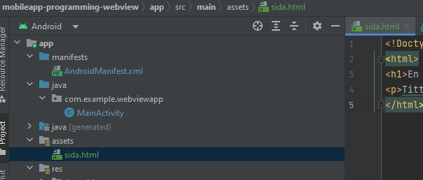
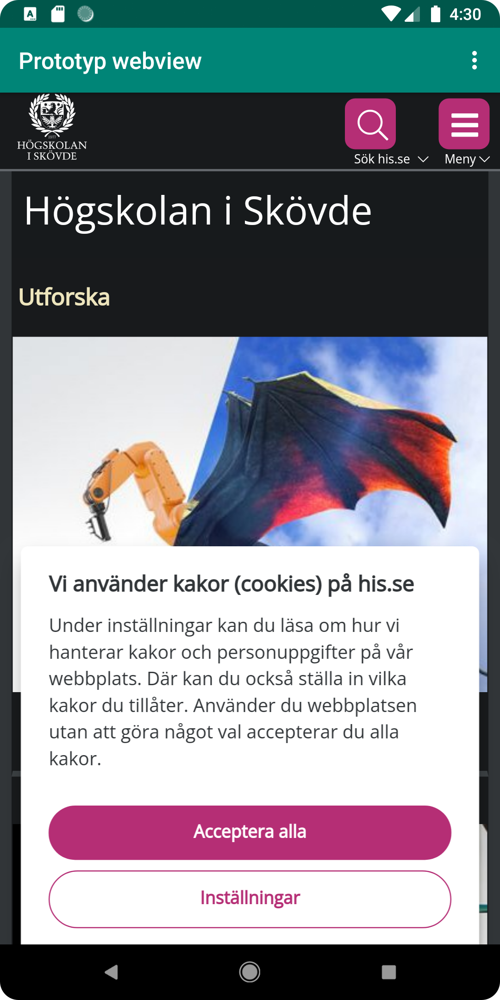
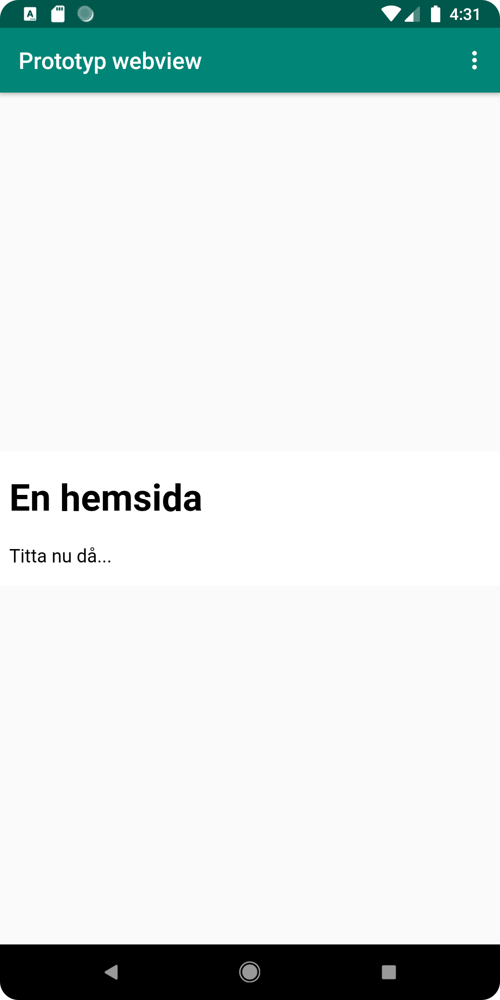

# Rapport

1. Klonar projektet och öppnar Android studio.

2. Ändrar namnet på appen till "Prototyp webview" i strings.xml
``` 
<string name="app_name">Prototyp webview</string>
```

3. Ger appen access till internet med hjälp av nedan rad i AndroidManifest.xml
``` 
<uses-permission android:name="android.permission.INTERNET" />
```

4. Skapar ett webView-element i layout-filen (activity_main.xml) genom att byta ut textview-elementet mot ett webview-element.
``` 
    <WebView
        android:id="@+id/my_webview"
```

5. För att lägga till ID läggs raden till som syns i koden ovan "android:id".

6. Skapar en private member i MainActivity.java, se andra raden nedan.
```
public class MainActivity extends AppCompatActivity {
private WebView myWebView;
```
Denna instansieras sedan under "onCreate()", se nedan.

```
myWebView = findViewById(R.id.my_webview);
```

7. Skapar en WebViewClient under "onCreate()".
```
myWebView.setWebViewClient(new WebViewClient());
```

8. Enablar javascript i WebViewClienten. Även denna ligger under "onCreate()".
```
WebSettings webSettings = myWebView.getSettings();
webSettings.setJavaScriptEnabled(true);
```

9. Skapar en mapp under "app" där jag väljer "assets". I denna skapar jag en väldigt enkel html-sida.


10. Med "myWebView.loadUrl" kan jag peka på både den externa och den interna adressen. Se nedan.
```
public class MainActivity extends AppCompatActivity {
private WebView myWebView;
public void showExternalWebPage(){
myWebView.loadUrl("https://www.his.se");
}
public void showInternalWebPage(){
myWebView.loadUrl("file:///android_asset/sida.html");
}
```

11. Under "onOptionsItemSelected()" kallas funktionerna för extern och intern hemsida. se nedan.
```
        if (id == R.id.action_external_web) {
            Log.d("==>","Will display external web page");
            showExternalWebPage();
            return true;
        }

        if (id == R.id.action_internal_web) {
            Log.d("==>","Will display internal web page");
            showInternalWebPage();
            return true;
        }
```

12. Resultatbilder för extern och intern.



    //a22chrfa